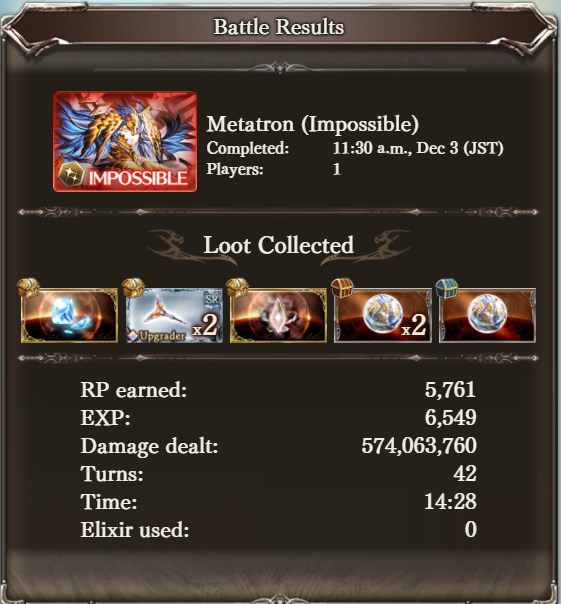

The prototype of the project developed as part of a course project. The specifications were to use 3 different programming languages in one system. Deployment was done with vagrant to keep testing environments consistent.

# GBF Parser

Analyzing battle data from the game Granblue Fantasy in order to present it in a sensible way since the in game summary is barebones.   


## Problem Statement

Gameplay in Granblue consists of 4 characters fighting against a boss in a turn-based action system. Each character has their own unique set of skills, normal attacks and occasion charged attacks. With fights that can last several minutes, it is difficult to make sense of each character's contribution to the fight. The image below is the only data available after a fight.
  
More information would help optimizing teams


## Implemented Features
3 fights were recorded and put into the Spring project in their own folder under resources. When the client makes requests for the list of fights, these three fights will show up as clickable links. Clicking a link will make another api call that will cause the server to parse the fight's data using python and return the output. The output is then used to display 4 pieces of information:
- How much damage did each person did in the fight?
  - Also their damage per turn.
- What is each character's average hit count per turn?
- How often does each character land a critical hit?

## Languages
- Python (pandas)
  - Used to filter json data to extract important information using
  - Allows the use of pandas to make summarizing the data easy
  - Stored in the Java Resources folder for access
- JavaScript (React)
  - Used to view the summarized battle data.
  - Uses chart libraries to visualize some of the data
- Java (Spring)
  - Used to receive filtered game data to store or maybe present
  - Makes creating a REST server easy 

## Inter-Language Communication
- Java -> Python
  - The server will call a python script to parse the file and return important data
- Javascript -> Java
  -The javascript program will make a REST API calls to the server to find the summarized battle data to display to the user

## Deployment
Vagrant + Chef template will be used.

2 ssh connections are needed, 1 to start the server and 1 to start the client. 

### Server  
The server will hook up to port 8080 which is opened based on the vagrant file  
```
cd /home/vagrant/project/spring  
./mvnw spring-boot:run  
```

### Client
The client will open hook up to port 3000 which is opened based on the vagrant file   
```
cd /home/vagrant/project/node/client
npm run
```

The client can be access on [localhost:3000](localhost:3000])

## References
[https://start.spring.io/](https://start.spring.io/) Was used to start the spring project
```
npx create-react-app
```
Was used to start the React javascript project